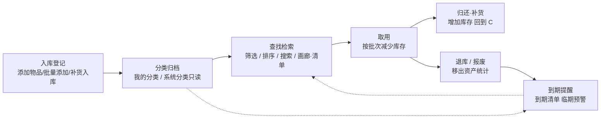

# 物品收纳管理 · 产品需求文档（PRD）

> 文档状态：初版（基于线上 **v32** 真实实现整理，未做任何代码改动）  
> 数据底座说明：本模块物理存储为浏览器 **localStorage**（JSON 字符串），非关系型数据库；下文"表"指 localStorage 键，"字段类型/长度"按 JSON 取值特性描述。  
> 适用端：移动端 H5 + 桌面端（同一套代码，响应式适配，GitHub Pages 托管）。

---

## 第一部分：文档说明

### 1.1 版本号

| 项目 | 内容 |
|------|------|
| 文档版本 | **v1.0.0** |
| 对应线上版本 | **v32**（Service Worker 缓存标识 `you-workbench-v32`） |
| 文档类型 | 企业级 PRD（产品 + UI + 数据架构） |
| 生成日期 | 2026-09-06 |

### 1.2 修订记录

| 版本 | 日期 | 修订人 | 修订说明 |
|------|------|--------|----------|
| v1.0.0 | 2026-09-06 | 产品 | 首版，基于 v32 源码静态分析输出完整 PRD |

### 1.3 术语表

| 术语 | 英文/缩写 | 说明 |
|------|-----------|------|
| 物品组 | group | 按「名称 + 一级分类 + 二级分类 + 图标」四元组合并去重后的逻辑物品，可包含多个物理物品对象 |
| 批次 | batch | 一次入库产生的记录，含数量、单价、总价、有效期、退库日期等；同一物品可有多批次 |
| 入库批次唯一标识符 | batchId | 由入库日期生成，格式 `YYYYMMDD入库`（如 `20260904入库`）；同日多次入库自动合并 |
| 有效批次 | active batch | 未退库的批次（退库日期为空，或退库日期 > 今天）；财务统计只计有效批次 |
| 退库 | retire | 物品不再计入资产/日均成本的操作；单件退库存于 `item.retiredDate`，批量退库按批次存于 `batch.retiredDate` |
| 取用 | use | 从某批次减少库存的操作，记录写入 `item.usings[]` |
| 置顶 | pin | 物品组在列表中优先展示，最多 10 个 |
| 合并（同日） | mergeSameDayBatches | 同一天多次入库合并为一条批次，数量相加、均价加权平均 |
| 墓碑 | tombstone | 已删除的物品/分类 id 列表，用于云端同步传播删除动作 |
| 总资产 | totalAsset | 所有有效批次总价之和 |
| 平均每日成本 | avgDailyCost | 各物品日均成本之和 |
| 物品容量 | capacity / categoryCount | 合并去重后的物品组数量，上限 9999 |

---

## 第二部分：业务概述

### 2.1 模块定位

> **[待补充：业务背景]** —— 请补充"为什么要做这个模块、解决了什么问题"（例如：解决家庭/个人物品无序堆放、不清楚资产总值与消耗成本、临期物品遗忘等问题）。

**已确认的模块定位（基于实现归纳）：**
- 面向个人/家庭物品的**全生命周期收纳管理**工具，隶属"自媒体创作工作台"的「物品收纳」分区。
- 核心价值：① 资产可视化（总资产、日均成本、容量）；② 入库/取用/退库全流程记录；③ 临期预警；④ 分类归档检索。
- 数据形态：**单机本地存储（localStorage）**，支持 JSON 导入/导出与（实验性）云端同步。

### 2.2 核心业务流程图（Mermaid）

> **[待补充：核心业务流程 的纯文本描述]** —— 下图为基于"入库→分类→查找→取用→归还/报废"链路绘制的流程图，请核对是否符合预期。

### 2.3 用户角色与权限

> **[待补充：是否需多角色 / 协作共享]** —— 当前版本为**单一用户（物品所有者）**模型，无登录、无多角色权限体系。下表为当前实现现状。

| 角色 | 说明 | 权限范围 |
|------|------|----------|
| 物品所有者（默认唯一用户） | 使用本机浏览器访问 | 全部读写：增删改物品、分类、设置、同步、置顶、取用、退库、导入导出 |

---

## 第三部分：数据库设计

> 物理实现：localStorage 键值对，值为 JSON 字符串。下方"长度"列指 JSON 取值特性（无硬长度限制时标注"JSON 不限"）。

### 3.1 表名：`wb_items_v2`（物品主表）

存储所有物品对象数组，每个元素为一个物品对象；系统每次保存同步写一份 `wb_items_v2_backup` 备份键。

| 字段名 | 字段类型 | 长度 | 是否必填 | 默认值 | 说明 |
|--------|----------|------|----------|--------|------|
| id | string(uuid) | JSON 不限 | 是 | uuid() 生成 | 物品唯一 ID |
| name | string | JSON 不限 | 是 | 空 | 物品名称 |
| icon | string | JSON 不限 | 否 | '📦' | 图标（emoji 或图片路径） |
| categoryId | string | JSON 不限 | 否 | 'cat_uncategorized' | 所属分类 ID（关联分类表 id） |
| purchaseDate | string(YYYY-MM-DD) | 10 | 否 | 今天 | 入库日期（决定批次唯一标识） |
| productionDate | string(YYYY-MM-DD) | 10 | 否 | 今天 | 生产日期 |
| location | string | JSON 不限 | 否 | 空 | 存放位置 |
| memo | string | JSON 不限 | 否 | 空 | 备注（同时作为批次 note） |
| retiredDate | string(YYYY-MM-DD) | 10 | 否 | 空 | 单件物品退库日期 |
| expectedDaily | number | — | 否 | 0 | 预期日均/单次成本 |
| usageCount | number | — | 否 | 0 | 使用次数 |
| maintenanceTotal | number | — | 否 | 0 | 累计维护支出 |
| calcMode | string('time'\|'freq'\|'none') | — | 否 | 'time' | 计算方式 |
| avgPrice | number | — | 否 | 0 | 购买均价（= 最后批次 unitPrice，不重算） |
| autoTakeOne | boolean | — | 否 | false | 入库后立即取用 1 件 |
| batches | array&lt;object&gt; | JSON 不限 | 是 | [] | 入库批次列表（核心，结构见 3.1.1） |
| usings | array&lt;object&gt; | JSON 不限 | 否 | [] | 取用记录列表（结构见 3.1.2） |
| createdAt | string(ISO) | JSON 不限 | 是 | toISOString() | 创建时间 |
| updatedAt | string(ISO) | JSON 不限 | 是 | toISOString() | 最后修改时间 |
| pinned | boolean | — | 否 | false | 是否置顶（最多 10 个） |
| starred | boolean | — | 否 | false | 收藏标记（**功能暂停**，仅保留字段） |
| qty / price / totalPrice | number | — | 否 | 0 | 兼容旧模型字段（按批次重算） |
| stockQty / inUseQty / scrappedQty / retiredQty | number | — | 否 | 0 | 兼容旧模型字段（报废/退役恒为 0） |

#### 3.1.1 批次对象 `batches[]`

| 字段名 | 字段类型 | 长度 | 是否必填 | 默认值 | 说明 |
|--------|----------|------|----------|--------|------|
| id | string | 11 | 是 | dateToBatchId() | 入库批次唯一标识符 = `YYYYMMDD入库` |
| date | string(YYYY-MM-DD) | 10 | 是 | 入库日期 | 入库日期（合并同日的 key） |
| quantity | number | — | 是 | 单件=1 / 批量=数量 | 本批次数量 |
| unitPrice | number | — | 是 | 0 | 本批次单价 |
| totalPrice | number | — | 是 | unitPrice×quantity | 本批次总价 |
| expiryDate | string(YYYY-MM-DD) | 10 | 否 | 空 | 有效期截止日 |
| retiredDate | string(YYYY-MM-DD) | 10 | 否 | 空 | 本批次退库日期（批量按批次退库） |
| note | string | JSON 不限 | 否 | 物品 memo | 备注 |

#### 3.1.2 取用对象 `usings[]`

| 字段名 | 字段类型 | 长度 | 是否必填 | 默认值 | 说明 |
|--------|----------|------|----------|--------|------|
| batchId | string | 11 | 是 | 空 | 取自哪个批次（= 批次 id） |
| date | string(YYYY-MM-DD) | 10 | 是 | 今天 | 取用日期 |
| quantity | number | — | 是 | 0 | 取用数量 |
| note | string | JSON 不限 | 否 | 空 | 取用备注 |

### 3.2 表名：`wb_item_categories_v2`（分类表）

存储用户自定义分类数组；系统内置分类（18 个一级 + 233 个二级）硬编码在前端常量，不入库。

| 字段名 | 字段类型 | 长度 | 是否必填 | 默认值 | 说明 |
|--------|----------|------|----------|--------|------|
| id | string | JSON 不限 | 是 | 'cat_xxx' / 'sys_*' | 分类唯一 ID（未分类固定 `cat_uncategorized`） |
| name | string | JSON 不限 | 是 | 空 | 分类名称 |
| icon | string | JSON 不限 | 否 | '📦' | 图标（emoji 或图片路径） |
| parentId | string\|null | JSON 不限 | 否 | null | 一级为 null；二级 = 父级 id |
| system | boolean | — | 是 | false | 是否系统内置（true=只读） |
| createdAt / updatedAt | string(ISO) | JSON 不限 | 否 | toISOString() | 时间戳 |

### 3.3 表名：`wb_items_settings_v2`（设置表）

单对象（非数组），保存视图与筛选偏好。

| 字段名 | 字段类型 | 长度 | 是否必填 | 默认值 | 说明 |
|--------|----------|------|----------|--------|------|
| hideAmount | boolean | — | 否 | false | 金额是否隐藏（总资产/日均打码） |
| viewMode | string('grid'\|'list') | — | 否 | 'grid' | 总览页卡片视图（画廊/清单） |
| sortField | string | — | 否 | 'purchaseDate' | 排序字段 |
| sortDir | string('asc'\|'desc') | — | 否 | 'asc' | 排序方向 |
| filters | object | JSON 不限 | 否 | {categories:[],statuses:[],starred:false} | 筛选条件 |
| catTab | string('my'\|'sys') | — | 否 | 'my' | 分类页当前页签 |
| sysCatChip | string | — | 否 | 'all' | 系统分类一级 chip 选中项 |

### 3.4 表名：`wb_items_tombstones_v2`（墓碑表）

存储已删除的物品/分类 id 列表，用于云端同步时传播删除动作。

| 字段名 | 字段类型 | 长度 | 是否必填 | 默认值 | 说明 |
|--------|----------|------|----------|--------|------|
| id | string | JSON 不限 | 是 | 空 | 已删除对象 ID |
| type | string | — | 否 | 'item' | 类型（item / category） |
| deletedAt | string(ISO) | JSON 不限 | 否 | toISOString() | 删除时间 |

---

## 第四部分：功能与页面设计

> 公共布局：每个页面挂载于 `#page-items` 容器下（`max-width: 960px` 居中）；子页通过 `showSubpage(name)` 切换 `.active` 显隐。左侧为工作台全局导航，顶部为各子页标题区。

### 4.1 页面：物品统计（总览页）

- **页面路径**：`#page-items` → `#i-subpage-overview`（前端路由，非独立 URL）
- **页面布局**：单列流式布局（顶部整行居中标题 → 总资产卡 → 即将到期模块 → "我的物品"工具栏+列表 → 右下角悬浮按钮）。无左侧导航（复用全局导航），无顶部筛选区（筛选/排序以弹层形式触发）。
- **核心组件清单**：
  - 卡片：① 总资产卡 `.i-asset-card` ×1（无固定高，padding 16px，圆角 24px）；② 统计小卡 `.i-stat-card` ×2（padding 10×12，圆角 16px）；③ 网格卡 `.i-grid-card`（图标圆 64×64）或清单卡 `.i-list-card`（图标圆 72×72）；④ 即将到期卡 `.i-expiring-module` ×1（padding 16px，圆角 16px）。
  - 弹窗：① 筛选弹层 `.i-modal`（宽 100% / 桌面 max-width 460px，max-height 85vh→80vh，圆角 24px）；② 排序弹层（同弹窗规格）；③ 同步弹层（同规格）；④ 图标选择器、日期滚轮、有效期选择器等（见 4.2）。
- **色板（Hex 色号）**：
  - 主色：`#5C7A4E`（墨绿，主按钮/角标/进度/激活）
  - 辅助色：`#4A6F3A`（深绿，激活选项/标签底）、`#E8F1E3`（浅绿，标签底/激活卡片底）
  - 背景色：`#F5F7F4`（页面/输入框/图标圆底）、`#FFFFFF`（卡片白底）
  - 文字色：`#1F2A1A`（主文字）、`#7B8276`（次要）、`#A5ABA2`（三级/占位）
  - 强调色：`#6B8E5A`（进度条填充）、总资产卡渐变 `linear-gradient(135deg,#E8F1E3 0%,#FFFFFF 100%)`
  - 危险色：`#E57373`（删除/过期角标）
- **字段清单**：

| 控件类型 | 字段名 | 显示文案 | 数据来源(表.字段) | 计算/存储逻辑 | 备注 |
|----------|--------|----------|-------------------|---------------|------|
| 金额文本 | iTotalAsset | 总资产 | wb_items_v2.batches[].totalPrice | 总资产 = Σ(每个物品 有效批次.totalPrice)；有效批次经 getActiveBatches() 排除已退库（retiredDate≤今天） | 点击眼睛按钮 iEyeBtn 切换 settings.hideAmount，显示 `¥ ****` |
| 金额文本 | iAvgDailyCost | 平均每日成本 | wb_items_v2.batches[].totalPrice + expiryDate + date | 平均每日成本 = Σ(物品i.getItemDailyCost)；getItemDailyCost = (有效批次 totalPrice 之和) ÷ daysDiffInclusive(最早批次date, 最早有效期) | 退库批次不计 |
| 文本+进度条 | iCapacityText / iCapacityFill | 物品容量 | groupItems 分组数 | 物品容量 = 按「名称\|一级\|二级\|图标」合并去重后的物品组数；进度% = min(组数 ÷ 9999 × 100, 100)% | 显示 `N / 9999` |
| 列表 | iExpiringList | 即将到期 | wb_items_v2.expiryDate | 取有效期距今 ≤5 天的物品，最多展示 5 条；无则整模块隐藏 | 点击"查看全部"→ 到期清单页 |
| 网格/清单容器 | iItemsContainer | 我的物品 | wb_items_v2 | 按 settings.viewMode 渲染网格(2/3/4列)或清单；卡片点击→物品档案页 | 空数据显示空状态插画 |
| 按钮 | iFilterBtn | 筛选 | wb_items_settings_v2.filters | 打开筛选弹层，写入 filters | — |
| 按钮 | iSortBtn | 排序 | wb_items_settings_v2.sortField/sortDir | 打开排序弹层，写入排序字段/方向 | — |
| 按钮 | iGalleryBtn | 画廊/清单 | wb_items_settings_v2.viewMode | 切换 grid/list，按钮文案随当前视图变化 | — |
| 按钮 | iSyncBtn | 同步 | — | 打开数据同步弹层 | 见 4.7 |
| 悬浮按钮 | iAddItemFab | +（添加物品） | — | 打开添加物品页（单件模式） | 固定右下角 56×56 圆，主绿底白字 |

### 4.2 页面：添加物品页

- **页面路径**：`#i-subpage-add`
- **页面布局**：`.i-header-stacked`（第一行"返回"，第二行整行居中标题"添加物品"）→ 标签页（单个物品/批量物品）→ 表单卡片（多个 `.i-form-card`）→ 底部操作栏（取消/保存）。
- **核心组件清单**：卡片：表单卡 `.i-form-card` × N（padding 16px，圆角 16px，卡片间距 12px）；图标选择按钮 56×56 圆；日期行滚轮 高 220px（3 列×item 10px padding）；有效期数字+单位输入；步进器（±按钮 32×32，输入框宽 60px）；开关 46×26。弹窗：图标选择器 / 分类滚轮 / 日期选择器 / 有效期选择器（宽 100%，桌面 max-width 460px，圆角 24px）。
- **色板**：同 4.1（主色 `#5C7A4E`、背景 `#F5F7F4`、卡片白 `#FFFFFF`、文字 `#1F2A1A`/`#7B8276`、危险 `#E57373`）。
- **字段清单（单件 / 批量 共用逻辑）**：

| 控件类型 | 字段名 | 显示文案 | 数据来源(表.字段) | 计算/存储逻辑 | 备注 |
|----------|--------|----------|-------------------|---------------|------|
| 输入框 | iName / iBatchName | 名称 | wb_items_v2.name | 新增时必填，空则提示 | — |
| 图标按钮 | iIconBtn | 图标 | wb_items_v2.icon | 打开图标选择器 | 默认 📦 |
| 分类触发 | iCategoryTrigger | 分类 | wb_items_v2.categoryId | 打开分类滚轮（仅一级） | — |
| 数字输入 | iPrice / iBatchUnitPrice | 购入价格/物品单价 | batches[].unitPrice | 单个固定数量1，总价=单价 | 批量：数量>0 |
| 数字输入 | iQty | 物品数量 | batches[].quantity | 步进器，必须>0 | 仅批量 |
| 自动计算 | iBatchTotalPrice | 物品总价 | batches[].totalPrice | 空则自动 = 单价×数量 | 仅批量 |
| 日期行 | iPurchaseDate | 入库日期 | wb_items_v2.purchaseDate + batches[].date + batches[].id | **默认值=今天**；决定批次唯一标识 `YYYYMMDD入库` | 见附录公式 |
| 日期行 | iProductionDate | 生产日期 | wb_items_v2.productionDate | 默认今天 | — |
| 日期行 | iRetireDate / iBatchRetireDate | 退库日期（选填） | wb_items_v2.retiredDate / batches[].retiredDate | 选填；维护且日期≤今天→不计入总资产/日均 | 批量按批次各自退库 |
| 日期行 | iExpiryDate | 有效期 | batches[].expiryDate | 必填，打开有效期弹层 | 空则提示 |
| 标签页 | calcMode | 计算方式(time/freq/none) | wb_items_v2.calcMode | 三个标签页单选 | — |
| 数字输入 | iExpectedDaily | 预期日均成本 | wb_items_v2.expectedDaily | 选填 | — |
| 数字输入 | iUsageCount | 使用次数 | wb_items_v2.usageCount | 选填 | — |
| 数字输入 | iMaintenance | 累计维护支出 | wb_items_v2.maintenanceTotal | 选填 | — |
| 输入框 | iLocation / iBatchLocation | 存放位置 | wb_items_v2.location | 选填 | — |
| 输入框 | iMemo / iBatchMemo | 备注说明 | wb_items_v2.memo | 选填；同时作批次 note | — |
| 开关 | iAutoTakeOne | 入库后立即取用1件 | wb_items_v2.autoTakeOne | 开启则保存后自动写一条 usings | 仅批量 |

> **保存逻辑 `saveItemForm()`**：新增→`batches=[新批次]`、`usings=[]`、初始化兼容字段；**编辑模式→仅 `batches.push(新批次)` 并 `mergeSameDayBatches` 合并同日批次，`usings` 保留不重置**（修复了旧版覆盖历史批次的 bug）。批次 id 一律 `dateToBatchId(入库日期)`。

### 4.3 页面：我的分类页

- **页面路径**：`#i-subpage-categories`
- **页面布局**：`.i-header-stacked`（"返回"+居中标题"我的分类"+副标题）→ 搜索框 → 页签（我的分类/系统分类只读）→ 分类组列表 / 系统分类 chip 行+二级网格。
- **核心组件清单**：卡片：分类组 `.i-cat-group`（圆角 16px，组头 padding 14×14）；系统卡 `.i-sys-card`（图标圆 64×64，padding 16×10）；未找到空卡 `.i-cat-nofound`（`grid-column:1/-1; width:100%` 占满整行、右缘贴屏幕边缘）。弹窗：新增/编辑分类弹窗（padding 22px）、分类图标选择器。
- **色板**：主色 `#5C7A4E`、浅绿 `#E8F1E3`、背景 `#F5F7F4`、卡片 `#FFFFFF`、文字 `#1F2A1A`/`#7B8276`、危险红 `#E57373`（删除按钮底 `#FDF2F2`）。
- **字段清单**：

| 控件类型 | 字段名 | 显示文案 | 数据来源(表.字段) | 计算/存储逻辑 | 备注 |
|----------|--------|----------|-------------------|---------------|------|
| 输入框 | iCatSearch | 搜索分类 | wb_item_categories_v2.name | 模糊匹配（包含+子序列）我的/系统一二级 | — |
| 页签 | iCatTabMy / iCatTabSys | 我的分类 / 系统分类（只读） | wb_items_settings_v2.catTab | 切换写入 catTab | 系统分类不可增删改 |
| 按钮 | iAddPrimaryBtn | 新增一级分类 | wb_item_categories_v2 | 仅"我的分类"页签显示 | 写自定义分类 |
| 文本 | 组标题/子分类数 | 一级分类名(N) | wb_item_categories_v2.name / children | 渲染自定义一级及子分类 | 支持编辑/删除/加子分类/展开 |
| chip行 | iSysChipRow | 一级分类筛选 | wb_items_settings_v2.sysCatChip | 选中写入 sysCatChip | 全部+18 个一级，可横滑 |
| 卡片网格 | iSysGrid | 二级分类 | 前端常量 SYSTEM_SECONDARY | 点击→预填分类去添加物品 | 系统数据硬编码 |

### 4.4 页面：到期清单页

- **页面路径**：`#i-subpage-expiring`
- **页面布局**：普通左对齐 header（"返回" + "到期清单"）→ 顶部摘要 → 清单列表（复用清单卡，过期项灰化+角标）。
- **核心组件清单**：清单卡 `.i-list-card`（同 4.1，图标圆 72×72）；过期角标 `.i-expired-badge`（背景 `#E57373`，白字，圆角 999px，10px）。
- **色板**：同 4.1（过期灰化背景 `#FDF4F4`、危险红 `#E57373`）。
- **字段清单**：

| 控件类型 | 字段名 | 显示文案 | 数据来源(表.字段) | 计算/存储逻辑 | 备注 |
|----------|--------|----------|-------------------|---------------|------|
| 文本 | iExpiringSummary | N 件即将到期 / M 件已过期 | wb_items_v2.expiryDate | 取有效期距今 ≤5 天；delta<0 为已过期 | — |
| 列表 | iExpiringList | 到期物品清单 | wb_items_v2 | 复用清单卡，过期项加 `.expired` 灰化 + "已过期 X 天"角标 | — |

### 4.5 页面：物品档案页

- **页面路径**：`#i-subpage-detail`
- **页面布局**：`.i-header-stacked`（"返回"+居中"物品档案"）→ 顶部大卡（图标+名称+日均+三列统计）→ 已入库天数模块 → 库存档案区（多行）→ 底部固定操作栏（入库/取用/编辑/分享/删除）。进入时隐藏右下角 FAB。
- **核心组件清单**：大卡 `.i-detail-hero`（图标 64×64 圆角 18px，padding 16×16×8）；三列统计格 `.i-detail-stat`（padding 12×8 圆角 12px）；库存档案行 `.i-detail-row`（每行 padding 13×0，下边框 1px）；底部固定栏 `.i-detail-bottom-actions`（`position:fixed; bottom:0; z-index:700` 全宽，按钮 flex:1）。弹窗：取用/取用批次/取用日期、补货入库、入库批次日期（仅显标识符）。
- **色板**：主色 `#5C7A4E`、浅绿 `#E8F1E3`、背景 `#F5F7F4`、卡片 `#FFFFFF`、文字 `#1F2A1A`/`#7B8276`、批量角标底 `#5C7A4E` 白字、收藏星激活 `#FFB800` 底 `#FFF8E1`、危险红 `#E57373`（删除）。
- **字段清单**：

| 控件类型 | 字段名 | 显示文案 | 数据来源(表.字段) | 计算/存储逻辑 | 备注 |
|----------|--------|----------|-------------------|---------------|------|
| 角标 | iDetailBatch | 批量 | batches.length / totalIn | `batches.length>1 \|\| 总入库>1` 显示，否则隐藏 | — |
| 文本 | iDetailHeroName | 物品名称 | name | — | — |
| 金额 | iDetailHeroDaily | 日均成本 | group.dailyCost | getItemDailyCost | — |
| 三列统计 | — | 当前库存/总入库量/已取用 | group.currentStock/totalIn/totalUsed | 库存=总入库−已取用 | — |
| 文本 | iDetailDays | 已入库 N 天 | batches[].date | 从最早批次到今天，含当日，维护当天为第1天 | 见附录 |
| 文本 | iDetailUsedPct | 已使用 X% | usings / batches | 已使用% = 总取用 ÷ 总入库 ×100% | — |
| 文本 | iDetailAvgPrice | 购买均价 | group.avgPrice | = 最后批次 unitPrice | — |
| 文本 | iDetailTotalPrice | 购买总价 | group.totalPrice | 有效批次合计 | — |
| 文本 | iDetailFirstDate | 首次入库时间 | batches[].date（最早） | **纯展示**（v32 起不可点击选批次） | — |
| 文本 | iDetailCategory | 所属分类 | 分类路径 | "一级 > 二级" | — |
| 文本 | iDetailLocation | 存放位置 | item.location | — | — |
| 可点击行 | iDetailCreated | 添加时间 | 选批次→batches[].date | 点击弹 iBatchDateModal（清单**只显标识符**），确定后显示所选批次入库日期 | — |
| 行（单件） | iDetailRetiredSingle | 退库日期 | item.retiredDate | 仅单件显示 | — |
| 两行（批量） | iDetailRetiredBatch + iDetailRetiredBatchDate | 退库日期 | 选批次→batches[].retiredDate | 仅批量显示；第一行选批次（只显标识符），第二行显示该批次退库日期 | — |
| 文本 | iDetailUpdated | 最后更新 | item.updatedAt | ISO→点格式 | — |
| 按钮 | iDetailRestockBtn | 入库 | — | openRestockModal 补货入库 | **仅批量物品显示**（单件隐藏） |
| 按钮 | use/edit/share/delete | 取用/编辑/分享/删除 | — | 取用→openUseModal；编辑→openEditItem；分享→**暂停（仅提示）**；删除→确认后移除+写墓碑 | 分享功能暂停 |

### 4.6 页面：编辑库存品页

- **页面路径**：`#i-subpage-edit`
- **页面布局**：`.i-header-stacked`（"返回"+居中"编辑库存品"）→ 卡片1（名称/图标/分类）→ 入库信息卡 → 退库日期（单件/批量）→ 存放位置 → 底部固定操作栏（取消/保存修改）。
- **核心组件清单**：编辑行 `.i-edit-row`（min-height 56px，padding 14×16）；底部栏 `.i-edit-bottom-actions`（`z-index:660` fixed 全宽）。弹窗：批次列表、退库批次选择（只显标识符）、日期选择。
- **色板**：同 4.1（确认按钮 `#4A664F` 白字）。
- **字段清单**：

| 控件类型 | 字段名 | 显示文案 | 数据来源(表.字段) | 计算/存储逻辑 | 备注 |
|----------|--------|----------|-------------------|---------------|------|
| 输入框 | iEditName | 名称 | wb_items_v2.name | — | — |
| 图标按钮 | iEditIconBtn | 图标 | wb_items_v2.icon | — | — |
| 分类触发 | iEditCatTrigger | 分类 | wb_items_v2.categoryId | — | — |
| 只读文本 | iEditQty | 物品数量 | getItemCurrentStock | 只读（不可改） | — |
| 输入框 | iEditUnitPrice | 物品单价 | 最后批次 unitPrice | 可改 | — |
| 输入框 | iEditTotalPrice | 物品总价 | 最后批次 totalPrice | 可改（空则=单价×数量） | — |
| 只读 | iEditBatchCount | 入库批次 | batches.length | 点击弹 iEditBatchListModal 看全部标识符 | — |
| 日期行（单件） | iEditRetiredDate | 退库日期（选填） | item.retiredDate + 单批次 retiredDate | 年月日选择+确定 | — |
| 选批次+日期（批量） | iEditRetiredBatchSel + iEditRetiredBatchDate | 退库日期（选填） | 各批次 retiredDate | 选批次（只显标识符）后逐批次保存 temp.editRetiredMap | — |
| 输入框 | iEditLocation | 存放位置 | wb_items_v2.location | — | — |

> **保存逻辑 `saveEdit()`**：写 name/icon/categoryId；最后批次单价/总价；avgPrice=最后批次单价；退库日期按单件/批量分别写入 item.retiredDate 或各 batch.retiredDate；刷新回档案页。

### 4.7 页面：数据同步弹层

- **页面路径**：弹层 `#iSyncModal`（挂载于总览页"同步"按钮触发）
- **页面布局**：底部弹层（圆角 20px 顶部，max-height 88vh）→ 当前后端/版本信息 → 操作按钮组（下载/上传/测试/刷新/导出/导入）。
- **核心组件清单**：弹层卡 `.i-bottom-sheet-card`（圆角 20px 顶部，max-height 88vh，handle 36×4）；导出按钮 `#4A664F`、导入 `#F0F0F0`、下载 `#FF6A00`、上传 `#05C160`、错误框 `#FDECEA`/`#F5C6C0` 字 `#B23A2E`。
- **字段清单**：

| 控件类型 | 字段名 | 显示文案 | 数据来源 | 计算/存储逻辑 | 备注 |
|----------|--------|----------|----------|---------------|------|
| 文本 | iSyncBackendLabel / iSyncVerLabel | 当前云端/版本 | SYNC_CONFIG.backend / APP_VERSION | 显示后端与版本 | — |
| 按钮 | iSyncPullBtn | 从云端下载 | doPull() | 下载云端 JSON，按 updatedAt 合并（last-write-wins），应用墓碑删除 | — |
| 按钮 | iSyncPushBtn | 同步到云端 | doPush() | **只上传**合并后数据，绝不改本地、绝不 applyTombstones（修复 v25 误删本机数据） | — |
| 按钮 | iSyncTestBtn | 测试连接 | 探测 api.github.com/gitee | 错误显示在 iSyncErrBox | — |
| 按钮 | iSyncReloadBtn | 强制刷新最新版 | 重新注册 SW 并刷新 | — | — |
| 按钮 | iSyncExportBtn | 导出 JSON | exportItems() | 下载 you-items-backup-日期.json（含 items+customCategories） | — |
| 按钮 | iSyncImportBtn | 导入 JSON | importItems() | 选文件后与本地按 id 合并（新数据优先） | — |

> **状态说明**：云端同步（GitHub）因 `api.github.com` 在大陆常不可达，推送/拉取多失败；已内置 Gitee 后端切换（`sync-config.js` 改 `backend:'gitee'`），尚未配置令牌。收藏、分享功能**暂停使用**。

---

## 第五部分：非功能性需求

### 5.1 性能

| 项 | 要求（基于实现归纳） |
|----|------|
| 渲染性能 | 列表使用分组合并（groupItems）后再渲染，避免海量 DOM；置顶排序为稳定二次排序 |
| 存储性能 | 每次主表保存同步写 `*_backup` 备份键；加载时 `consolidateAllBatches()` 幂等合并同日批次 |
| 缓存 | Service Worker 缓存静态资源（版本 `you-workbench-vN`），支持离线访问与"添加到主屏幕" |
| 同步性能 | 同步以 JSON 全量上传/下载，last-write-wins 合并；非增量 |

### 5.2 安全

| 项 | 说明 |
|----|------|
| 数据隔离 | localStorage 按浏览器+设备隔离，手机端与电脑端**不共享**，需手动导入/导出或云端同步 |
| 删除保护 | 推送（doPush）绝不改本地、绝不 applyTombstones，避免误删本机数据（v25 教训） |
| 金额隐私 | 支持 `hideAmount` 打码（`¥ ****`），防止旁观者看到资产 |
| 令牌安全 | 云端同步令牌写于 `sync-config.js`（前端明文），**存在泄露风险**，建议改为用户登录态或后端代理 |

### 5.3 兼容性

| 项 | 说明 |
|----|------|
| 响应式 | 网格：手机 2 列、≥768px 3 列、≥1024px 4 列；系统分类网格 ≥1024px 4 列；图标网格 ≥1024px 8 列 |
| 安全区 | 底部栏/编辑页/FAB 均用 `env(safe-area-inset-bottom)` 适配刘海屏 |
| 浏览器 | 现代移动端浏览器（Chrome/Edge/Safari）；PWA 安装依赖 beforeinstallprompt（OPPO/微信内打开常不触发，需引导用 Chrome 菜单"添加到主屏幕"） |
| 数据格式 | localStorage JSON；导入导出为标准 JSON 文件 |

---

## 第六部分：附录

### 6.1 字段计算公式汇总表

| 计算项 | 公式 | 说明 |
|--------|------|------|
| 入库批次唯一标识符 | `batchId = YYYYMMDD + "入库"`（如 `20260904入库`） | 由 `dateToBatchId(purchaseDate)` 生成 |
| 同日合并（数量） | `新数量 = Σ(同日各批次.quantity)` | `mergeSameDayBatches` |
| 同日合并（均价） | `加权均价 = (Σ totalPrice) ÷ (Σ quantity)` | 同日多批次合并后单价 |
| 批次总价 | `batch.totalPrice = batch.unitPrice × batch.quantity` | 缺失时按 unitPrice×quantity 兜底 |
| 有效批次判定 | `有效 = (retiredDate 为空) 或 (retiredDate > 今天)` | `getActiveBatches()` |
| **总资产** | `总资产 = Σ(每个物品 有效批次.totalPrice)` | 已退库批次不计入 |
| **平均每日成本** | `平均每日成本 = Σ(物品i. getItemDailyCost)`；`getItemDailyCost = (有效批次 totalPrice 之和) ÷ daysDiffInclusive(最早批次date, 最早有效期)` | 退库批次不计；无有效期则日均为 0 |
| 含头天数差 | `daysDiffInclusive(a,b) = floor((b−a)/86400000) + 1` | 含首尾两天 |
| **物品容量** | `物品容量 = count(distinct( name \| primaryId \| secondaryId \| icon ))` | 四元组合并去重后的组数 |
| 容量进度% | `进度% = min( 物品容量 ÷ 9999 × 100, 100 )%` | 上限 9999 |
| **当前库存** | `当前库存 = Σ(批次.quantity) − Σ(取用.quantity)` | `getItemCurrentStock` |
| 批次可用量 | `批次可用量 = 批次.quantity − Σ(该批次已取用.quantity)` | `getBatchAvailableQty` |
| **已入库天数** | `已入库天数 = max(1, floor((今天 − 最早批次date)/86400000) + 1)` | 维护当天为第 1 天，最小 1 |
| **已使用%** | `已使用% = 总取用量 ÷ 总入库量 × 100%` | — |
| 退库判定（单件） | `已退库 = (item.retiredDate 非空) 且 (retiredDate ≤ 今天)` | `isRetired()` |
| 购买均价 | `avgPrice = 物品.avgPrice（维护时填的单价，不重算）` | 优先取最后批次 unitPrice |

### 6.2 待补充清单

| 序号 | 待补充项 | 位置 | 说明 |
|------|----------|------|------|
| 1 | **业务背景** | 2.1 | 请补充"为什么要做这个模块、解决了什么问题" |
| 2 | **核心业务流程（纯文本描述）** | 2.2 | 流程图已按"入库→分类→查找→取用→归还/报废"绘制，请核对文字描述 |
| 3 | **用户角色与权限细化** | 2.3 | 当前为单用户模型；如需多角色/协作共享请补充 |
| 4 | **云端同步后端正式配置** | 4.7 / 5.2 | Gitee 令牌未配置；GitHub 在大陆常不可达，需确定正式同步方案 |
| 5 | **收藏 / 分享功能正式方案** | 4.5 | 当前暂停使用，如需启用请补充产品逻辑 |
| 6 | **数据库表"长度"列精确约束** | 第三部分 | 物理存储为 localStorage JSON，无硬长度限制；如改用关系型数据库需补充字段长度/索引 |

---

*文档结束。本 PRD 全部结论来自对线上 v32 源码（index.html / css/items.css / js/items.js）的静态分析，未运行或修改任何文件。*
